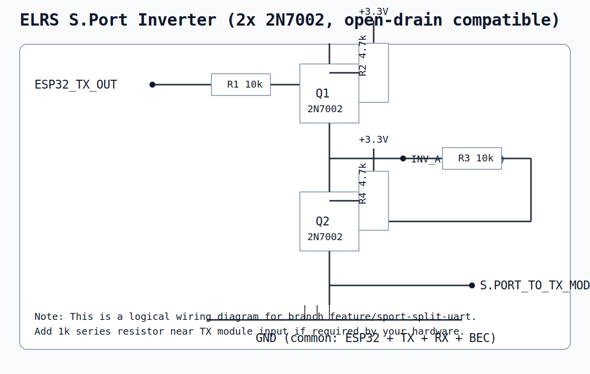
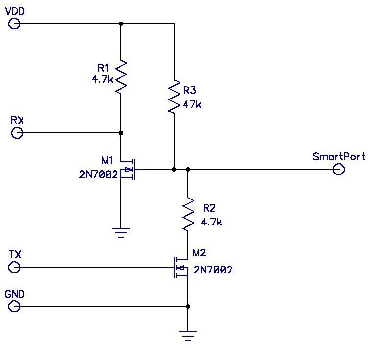
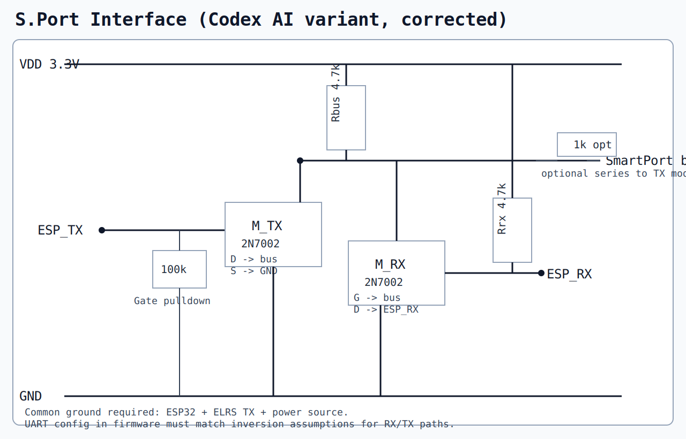

# ELRS Repeater Pro (ESP32 + PlatformIO)

Полудуплексный ретранслятор CRSF/ExpressLRS на `ESP32-WROOM-32` с:
- ретрансляцией управления от аппаратуры к дрону;
- попыткой прозрачной обратной передачи телеметрии;
- веб-интерфейсом (`Dashboard / Transmitter / Receiver / WiFi`);
- хранением настроек в NVS (`Preferences`);
- поддержкой SD/LittleFS для кастомной страницы `tx_interface.html`.

## 1. Статус проекта

- Управление (`аппа -> ретранслятор -> TX -> дрон`) работает.
- WiFi AP работает, но при включенном мощном TX-модуле может «теряться» из-за ВЧ-помех рядом с ESP32.
- Телеметрия от дрона в текущей аппаратной конфигурации может отсутствовать; в прошивке добавлена диагностика `TXDIAG` в Serial.

## 2. Платформа и среда

- МК: `ESP32 DOIT DevKit V1` (`board = esp32doit-devkit-v1`)
- Framework: `Arduino`
- Среда: `PlatformIO`
- Основные библиотеки:
  - `WiFi`, `WebServer`, `Preferences`
  - `ArduinoJson`
  - `SD`, `LittleFS`
  - `driver/uart.h` (инверсия/режим UART)

## 3. Подключение (текущая схема)

### 3.1 ELRS приемник (у ретранслятора)

- RX TX -> `GPIO16` (UART2 RX)
- RX RX -> `GPIO17` (UART2 TX)
- RX VCC -> `3.3V`
- RX GND -> `GND`

### 3.2 ELRS передатчик (к дрону, S.Port линия)

- TX S.Port data -> `GPIO32`
- В линии данных:
  - последовательно `1 kOhm`
  - подтяжка `4.7 kOhm` к `3.3V`
- TX VCC -> через реле (от внешнего BEC/источника)
- TX GND -> общий `GND`

#### 3.2.1 Различия веток (S.Port и инвертор)

- `main`:
  - текущая рабочая схема с одной полудуплексной линией `S.Port` на `GPIO32` (open-drain + подтяжка).
- `feature/sport-split-uart`:
  - ветка для варианта с внешним инвертором на `2N7002`;
  - цель: упростить отладку телеметрии и перейти к более предсказуемому разделению направлений `TX->ESP` и `ESP->TX`.

Схема инвертора на `2N7002`:



Планируемая схема (черновик):



Быстрая проверка черновика:
- в текущем рисунке `M1` управляется от `RX`, что обычно неверно для входа UART ESP32 (вход не должен управлять шиной);
- `M2` тянет `SmartPort` к земле через `R2=4.7k`, это делает «0» слабым; для надёжного TX-пула обычно нужен прямой сток `M2` на линию (с внешней подтяжкой линии к `VDD`).
- перед финальной разводкой стоит отдельно утвердить роль каждого узла (`RX input`, `TX open-drain`, `S.Port bus`) и логические уровни/инверсию.

Вариант от Codex AI (исправленная логика подключения):



Что изменено в варианте от Codex AI:
- добавлена единая подтяжка шины `SmartPort` к `VDD` (`Rbus = 4.7k`);
- путь `ESP_TX -> SmartPort` сделан через отдельный MOSFET `M_TX` с прямым стоком на шину и источником на `GND` (open-drain);
- на затвор `M_TX` добавлен `100k` pulldown к `GND` для стабильного старта;
- путь `SmartPort -> ESP_RX` вынесен в отдельный MOSFET `M_RX`, а `ESP_RX` подтянут к `3.3V` через `Rrx = 4.7k`;
- убрана слабая протяжка шины через резистор в цепи «прижатия к нулю».

### 3.3 Реле питания TX

- `GPIO5` -> вход реле (`IN`)

### 3.4 Светодиод

- `GPIO2` (активный LOW: горит при `0`)
- через `220 Ohm` на анод

### 3.5 SD карта (SPI)

- `CS` -> `GPIO15`
- `MOSI` -> `GPIO23`
- `MISO` -> `GPIO19`
- `SCK` -> `GPIO18`
- `VCC` -> `3.3V`
- `GND` -> `GND`

## 4. Важные требования по питанию/EMI

- Общий `GND` обязателен между ESP32, RX, TX и BEC.
- Рядом с TX питанием желательно:
  - электролит ~`470 uF`
  - керамика `100 nF`.
- Если TX физически близко к ESP32/антенне ESP32, WiFi AP может деградировать.

## 5. Сборка и прошивка

Из корня проекта:

```powershell
.\.venv\Scripts\pio.exe run
.\.venv\Scripts\pio.exe run -t upload
```

Монитор:

```powershell
.\.venv\Scripts\pio.exe device monitor --port COM7 --baud 115200
```

## 6. Web/API

- Web UI: `http://192.168.4.1/`
- JSON статус: `http://192.168.4.1/api/status`

Ключевые поля в `/api/status`:
- `linkRadio`
- `linkCopter`
- `packets`
- `txIn`, `txFwd`, `txCrcBad`, `txBytesIn` (диагностика потока TX->RX)

## 7. Диагностика через Serial

Каждые 2 секунды печатается:

```text
TXDIAG total[bytes=... in=... fwd=... bad=...] delta[bytes=... in=... fwd=... bad=...]
```

Интерпретация:
- `bytes=0` постоянно: ESP32 не получает вообще байты с линии TX (аппаратная проблема/инверсия/пин/проводка).
- `in>0`, `fwd=0`, `bad>0`: кадры есть, но валятся по CRC/формату.
- `in>0`, `fwd>0`: форвард телеметрии работает, искать проблему дальше в тракте RX/аппаратура.

## 8. Ветки Git

Текущие ветки:

- `main`
  - базовая рабочая линия проекта;
  - текущая single-wire схема `S.Port` через `GPIO32`.

- `feature/sport-split-uart`
  - ветка для разработки варианта с внешним инвертором и идеей раздельных направлений (`RX/TX`) для упрощения отладки;
  - именно в этой ветке предполагается развивать конфигурацию с инвертором на транзисторах и более простой диагностикой потока телеметрии.

## 9. Папки проекта

- `src/main.cpp` — основная прошивка
- `platformio.ini` — конфиг сборки
- `sdcard/www/tx_interface.html` — кастомный web UI для вкладки Transmitter
- `sdcard/www/style.css`, `sdcard/www/script.js` — ресурсы интерфейса

## 10. Что делать дальше (рекомендуется)

1. Если нет телеметрии при рабочем управлении: смотреть `TXDIAG` в Serial.
2. Если `txBytesIn=0`: проверять физический канал TX->ESP32 (проводка, инверсия, GND, подтяжка, источник сигнала).
3. При переходе на схему с инвертором и раздельными линиями развивать код в `feature/sport-split-uart`.
